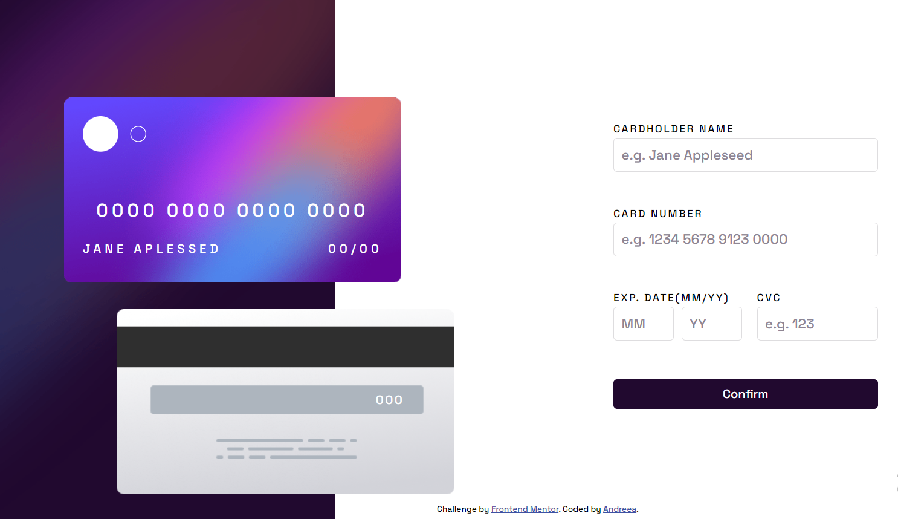

# Frontend Mentor - Interactive card details form solution

This is a solution to the [Interactive card details form challenge on Frontend Mentor](https://www.frontendmentor.io/challenges/interactive-card-details-form-XpS8cKZDWw). Frontend Mentor challenges help you improve your coding skills by building realistic projects.

## Table of contents

- [Overview](#overview)
  - [The challenge](#the-challenge)
  - [Screenshot](#screenshot)
  - [Links](#links)
- [My process](#my-process)
  - [Built with](#built-with)
  - [What I learned](#what-i-learned)

## Overview

### The challenge

Users should be able to:

- Fill in the form and see the card details update in real-time
- Receive error messages when the form is submitted if any input field is empty
- See hover, active, and focus states for interactive elements on the page

### Screenshot

### Links

- Live Site URL: https://interactivecardapp.netlify.app/

## My process

### Built with

- HTML
- CSS
- JavaScript
- Flexbox

### What I learned

Completing the Frontend Mentor challenge I improved my understanding of HTML, CSS, and JavaScript interactions in creating dynamic web forms. It also enhanced my skills in UI/UX design principles, prioritizing user feedback and usability. Additionally, I practiced problem-solving and debugging techniques to address issues related to form validation and real-time updates.
